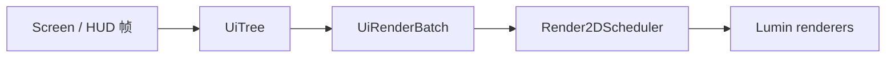

# 渲染

## Lumin Graphics 概览

Lumin Graphics 是 Epsilon 自有的渲染框架，源码位于 `common/src/main/java/com/github/epsilon/graphics/`：

```text
graphics/
├── renderers/   Rect、RoundRect、RoundRectOutline、Shadow、Triangle、Arc、Texture、Text
├── schedulers/  render2d（命令、layer、scissor、纹理）、render3d（3D 命令收集）
├── shaders/     Blur、FXAA、Filter、MotionBlur、CustomSky、GlslSandBox
├── text/        StaticFontLoader、TtfFontLoader、SystemEmojiAtlas、IconChars
├── buffer/      LuminRingBuffer、BufferUtils
├── immediate/   LuminImmediateRenderer
└── video/       VideoPlayer
```

框架自带 UI 库见 [GUI Library](../gui-library.md)，Screen 宿主见 [GUI 架构](../gui.md)。

## Renderer 生命周期

所有 renderer 实现 `IRenderer`（`draw()`、`clear()`、`drawAndClear()`、`close()`，以及共享
RenderPass 使用的 `prepareSharedDraw()` / `draw(RenderPass)`）。约束：

1. renderer 必须在渲染线程创建和使用；推荐 `Suppliers.memoize(Renderer::create)` 延迟创建。
2. `XxxRenderer.create()` 会把自己注册到 `RendererManager`，关闭由 `destroyAll()` 统一处理。
3. 一帧内 `clear()` 之后不得再 `draw()`/`drawAndClear()`；`drawAndClear()` 之后同样不得再次绘制。
   需要多轮清空-绘制时使用新的 renderer 或 `Render2DScheduler`。
4. renderer 使用 16 KiB 起步的 `LuminRingBuffer`，按需 `ensureCapacity` 扩容；内容不变的帧可以重复
   `draw()` 复用已上传的 GPU 数据。

```java
private final Supplier<RectRenderer> rectRenderer = Suppliers.memoize(RectRenderer::create);

rectRenderer.get().addRect(10f, 10f, 100f, 100f, Color.WHITE);
rectRenderer.get().drawAndClear();
```

## Render2DScheduler

`Render2DScheduler` 是 2D GUI 的唯一调度入口，负责 layer、scissor、空间桶、批次规划和 renderer 复用：

- GUI 只提交声明式命令，`LayerHandle.add*` 写入命令流；`flush()` 时才规划批次并绘制。
- 小批量 layer 使用平铺列表，超过 `DEFAULT_QUADTREE_THRESHOLD`（192）后升级为四叉树。
- flush 前恢复提交序，再按命令种类和 scissor 规划批次；`KIND_FLUSH_ORDER` 固定了 shadow → roundRect →
  outline → rect → triangle → arc → texture → 各类文本的输出顺序。
- 需要严格遮挡顺序时必须使用不同 layer 或相对 layer，不能依赖同一 layer 内不同 pipeline 的提交顺序。

## 2D UI 渲染链



帧边界由 `MixinGuiRenderer` 在 `GuiRenderer.render` 头部驱动：

```text
GuiRenderer.render HEAD
  -> HudEditorScreen.renderPendingHudElements()
  -> Render2DEvent.Level（世界 2D 覆盖层）
  -> EpsilonGuiRenderer.render() / endFrame()
  -> Render2DEvent.HUD（HUD 与界面）
  -> EpsilonGuiRenderer.render() / endFrame()
  -> 原版 GuiRenderer 继续提交提取结果
```

`HudElementManager` 订阅 `Render2DEvent.HUD`：先 `scene.beginFrame()`，逐个启用的 `HudModule` 调用
`renderWithBatch(deltaTracker, scene.batch(UiLayer.CONTENT))` 提交声明式节点，再 `scene.endFrame()`
统一 flush；随后对每个元素调用 `renderOverlay(GuiGraphicsExtractor, DeltaTracker)` 补画物品等原版内容。
同一个 `UiScene` 的 `beginFrame()` 与 `endFrame()` 必须配对，`endFrame()` 之后不得再向该帧提交命令。

## 保留的 3D 路径

`Render3DScheduler.INSTANCE` 是 Epsilon 的 3D 命令收集入口，支持填充盒、描边盒、侧面、线条和模糊盒。
它订阅 `Render3DEvent` 并在 priority `-999` 统一 flush 并清空，生产者的 priority 必须大于 `-999`。
3D shader、buffer 和 immediate renderer 仍在 `graphics/` 中维护，不经过 2D runtime。

## 后处理与 shader

- `BlurShader.INSTANCE.render(...)` 做 2D 区域模糊，`render3DBox(AABB, strength)` 由 3D scheduler 调用。
- `FXAAShader.INSTANCE.renderMainTarget()`、`FilterShader.INSTANCE.renderToMainTarget(color)`、
  `MotionBlurShader.INSTANCE` 直接作用于主 render target，由对应模块驱动。
- `CustomSkyShader.INSTANCE.render(target, CustomSky.INSTANCE)` 由 `MixinLevelRenderer` 在天空阶段调用。
- `GlslSandBox` 提供主菜单背景着色器（sea level、clouds、alien terrain、inferno、planet、black hole、
  minecraft 等）。

调用后处理前必须核验 render target 尺寸、采样器和当前 `RenderPipeline` 状态，避免引用已释放的
texture/view；GPU 资源只由创建它们的渲染线程释放。

## 字体

- `StaticFontLoader.DEFAULT` 是业务默认字体，另有 `ICONS`、`JURA_LIGHT`、`CINZEL_DECORATIVE`、
  `OSAKA_CHIPS` 等内置 TTF。
- `TtfFontLoader` 以 atlas 批量渲染字形：`requestChars`/`prepareChars` 提交请求，
  `drainReadyGlyphs` 在渲染线程按预算上传；`TtfFontLoader.beginRenderFrame()` 每帧重置预算，
  预算由 `ClientSetting.fontGlyphsPerFrame` 映射到 `TtfFontLoader.setMaxGlyphUploadsPerFrame(...)`。
- `StaticFontLoader.defaultFont()` 依据 `ClientSetting.font`（Default/Custom）解析字体；Custom 模式先按
  绝对/相对路径直接查找，相对路径再依次尝试工作目录和用户目录 `.epsilon/fonts/`，最后按文件名在系统
  字体目录中递归查找；路径不可读或字体无效时回退内置字体并记录日志。
- Vulkan 后端下 atlas 上传必须走 `TtfGlyphAtlas` 内部的 `TransientMemory.allocateStaging` +
  `copyBufferToTexture`：blaze3d 的 `writeToTexture(ByteBuffer)` 固定按 alignment = 1 申请 staging，
  R8 字形长度不保证 4 字节对齐，会让共享暂存游标错位，导致后续 RGBA8 纹理上传出现非法的
  `VkBufferImageCopy.bufferOffset`；OpenGL 后端保持原有上传路径。后端由
  `LuminRenderSystem.IS_VULKAN_BACKEND` 判定一次并复用，不得在调用点重复查询 `DeviceInfo`。
- 文本测量与绘制必须使用同一 `TtfFontLoader` 与 scale：`TextRenderer.getWidth/getHeight` 与
  `addText` 共享字体实例。

## World To Screen

`com.github.epsilon.utils.render.WorldToScreen` 提供三个公共函数：

- `calcWorld2ScreenRaw(Vec3)`：返回 Lumin 逻辑坐标 `Vector3f`，`z` 是以世界单位表示的视图空间前向深度。
- `calcWorld2Screen(Vec3)`：默认入口；深度小于 `Camera.PROJECTION_Z_NEAR` 时返回 `null`。
- `calcScale(Vec3)`：按当前投影矩阵返回透视 UI 缩放；每世界单位投影为 20 个 Lumin 像素时取 `1.0`，
  深度无效时返回 `0`。

2D AABB 边界必须投影全部 8 个顶点后取屏幕空间最小/最大值，并把跨越近裁剪面的边与近裁剪面的交点纳入
边界；没有有效投影时拒绝该边界。调用方不得再次除以 GUI scale，也不得自行用归一化深度判断摄像机后方。

## 原版桥接

`EpsilonGuiRenderer` 复用原版 `GuiRenderState` 与 `FeatureRenderDispatcher`，负责在 Epsilon 事件之后
提交提取结果。需要走原版管线的内容（物品、提示框等）继续使用 `GuiGraphicsExtractor`；Epsilon 的
UI 节点则由 Lumin 渲染，两者在 `GuiRenderer.render` 中按固定顺序合并。
