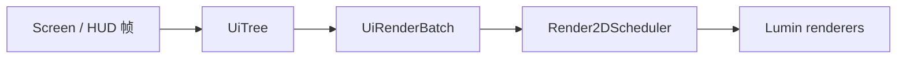

# 渲染

## Lumin Graphics 概览

Lumin Graphics 是 Epsilon 自有的渲染框架，源码位于 `common/src/main/java/com/github/epsilon/graphics/`：

```text
graphics/
├── renderers/   Rect、RoundRect、RoundRectOutline、Shadow、Triangle、Arc、Texture、Text
├── schedulers/  render2d（命令、layer、scissor、纹理）、render3d（3D 命令收集）
├── shaders/     Blur、FXAA、Filter、MotionBlur、CustomSky、GlslSandBox
├── text/        StaticFontLoader、TtfFontLoader、SystemEmojiAtlas、IconChars
├── buffer/      LuminRingBuffer、BufferUtils
├── immediate/   LuminImmediateRenderer
└── video/       VideoPlayer
```

框架自带 UI 库见 [GUI Library](../gui-library.md)，Screen 宿主见 [GUI 架构](../gui.md)。

## Renderer 生命周期

所有 renderer 实现 `IRenderer`（`draw()`、`clear()`、`drawAndClear()`、`close()`，以及共享
RenderPass 使用的 `prepareSharedDraw()` / `draw(RenderPass)`）。约束：

1. renderer 必须在渲染线程创建和使用；推荐 `Suppliers.memoize(Renderer::create)` 延迟创建。
2. `XxxRenderer.create()` 会把自己注册到 `RendererManager`，关闭由 `destroyAll()` 统一处理。
3. 一帧内 `clear()` 之后不得再 `draw()`/`drawAndClear()`；`drawAndClear()` 之后同样不得再次绘制。
   需要多轮清空-绘制时使用新的 renderer 或 `Render2DScheduler`。
4. renderer 使用 16 KiB 起步的 `LuminRingBuffer`，按需 `ensureCapacity` 扩容；内容不变的帧可以重复
   `draw()` 复用已上传的 GPU 数据。

```java
private final Supplier<RectRenderer> rectRenderer = Suppliers.memoize(RectRenderer::create);

rectRenderer.get().addRect(10f, 10f, 100f, 100f, Color.WHITE);
rectRenderer.get().drawAndClear();
```

## Render2DScheduler

`Render2DScheduler` 是 2D GUI 的唯一调度入口，负责 layer、scissor、空间桶、批次规划和 renderer 复用：

- GUI 只提交声明式命令，`LayerHandle.add*` 写入命令流；`flush()` 时才规划批次并绘制。
- 小批量 layer 使用平铺列表，超过 `DEFAULT_QUADTREE_THRESHOLD`（192）后升级为四叉树。
- flush 前恢复提交序，再按命令种类和 scissor 规划批次；`KIND_FLUSH_ORDER` 固定了 shadow → roundRect →
  outline → rect → triangle → arc → texture → 各类文本的输出顺序。
- 需要严格遮挡顺序时必须使用不同 layer 或相对 layer，不能依赖同一 layer 内不同 pipeline 的提交顺序。

## 2D UI 渲染链



帧边界由 `MixinGuiRenderer` 在 `GuiRenderer.render` 头部驱动：

```text
GuiRenderer.render HEAD
  -> HudEditorScreen.renderPendingHudElements()
  -> Render2DEvent.Level（世界 2D 覆盖层）
  -> EpsilonGuiRenderer.render() / endFrame()
  -> Render2DEvent.HUD（HUD 与界面）
  -> EpsilonGuiRenderer.render() / endFrame()
  -> 原版 GuiRenderer 继续提交提取结果
```

`HudElementManager` 订阅 `Render2DEvent.HUD`：先 `scene.beginFrame()`，逐个启用的 `HudModule` 调用
`renderWithBatch(deltaTracker, scene.batch(UiLayer.CONTENT))` 提交声明式节点，再 `scene.endFrame()`
统一 flush；随后对每个元素调用 `renderOverlay(GuiGraphicsExtractor, DeltaTracker)` 补画物品等原版内容。
同一个 `UiScene` 的 `beginFrame()` 与 `endFrame()` 必须配对，`endFrame()` 之后不得再向该帧提交命令。

26.3 会在 `Minecraft` 构造函数内渲染首帧，此时 `Constants.mc`（`EpsilonCommon.init()` 中赋值）仍为
`null`。依赖 `mc` 的渲染入口必须自行判空或延后到初始化完成，`MixinGuiRenderer` 就是在这个前提下跳过
首帧的。

## 保留的 3D 路径

`Render3DScheduler.INSTANCE` 是 Epsilon 的 3D 命令收集入口，支持填充盒、描边盒、侧面、线条和模糊盒。
它订阅 `Render3DEvent` 并在 priority `-999` 统一 flush 并清空，生产者的 priority 必须大于 `-999`。
3D shader、buffer 和 immediate renderer 仍在 `graphics/` 中维护，不经过 2D runtime。

## 后处理与 shader

- `BlurShader.INSTANCE.render(...)` 做 2D 区域模糊，`render3DBox(AABB, strength)` 由 3D scheduler 调用。
- `FXAAShader.INSTANCE.renderMainTarget()`、`FilterShader.INSTANCE.renderToMainTarget(color)`、
  `MotionBlurShader.INSTANCE` 直接作用于主 render target，由对应模块驱动。
- `CustomSkyShader.INSTANCE.render(target, CustomSky.INSTANCE)` 由 `MixinLevelRenderer` 在天空阶段调用。
- `GlslSandBox` 提供主菜单背景着色器（sea level、clouds、alien terrain、inferno、planet、black hole、
  minecraft 等）。

调用后处理前必须核验 render target 尺寸、采样器和当前 `RenderPipeline` 状态，避免引用已释放的
texture/view；GPU 资源只由创建它们的渲染线程释放。

## 26.3 GPU 抽象（renderpearl）

26.3 把原本位于 `com.mojang.blaze3d.*` 的 GPU 抽象拆到 `com.mojang.renderpearl`，迁移时必须按新包名
引用，不能再沿用旧路径：

| 26.2 路径 | 26.3 路径 |
|---|---|
| `blaze3d.textures.*` | `renderpearl.api.textures.*`（`GpuTexture`、`GpuTextureView`、`GpuSampler`、`FilterMode`、`AddressMode`） |
| `blaze3d.buffers.GpuBuffer/GpuBufferSlice` | `renderpearl.api.buffers.*` |
| `blaze3d.systems.RenderPass/CommandEncoder` | `renderpearl.api.commands.*` |
| `blaze3d.pipeline` 的 `RenderPipeline`、`ColorTargetState`、`BlendFunction`、`DepthStencilState`、`BindGroupLayout` | `renderpearl.api.pipeline.*` |
| `blaze3d.shaders`、`blaze3d.platform.CompareOp/BlendFactor`、`blaze3d.GpuFormat/IndexType/PrimitiveTopology` | `renderpearl.api.pipeline` / `renderpearl.api` |
| `blaze3d.opengl.*` | `renderpearl.backend.opengl.*` |
| `blaze3d.vertex.VertexFormat/VertexFormatElement` | `renderpearl.api.vertex.*` |

`com.mojang.blaze3d` 仍保留 `PoseStack`、`VertexConsumer`、`platform`、`resource`、`framegraph`、
`systems.RenderSystem` 以及 `pipeline.RenderTarget/TextureTarget/MainTarget` 等类型。

RenderPass 的使用方式也随之收紧：

- `RenderPass.setPipeline(...)` 只接受 `CompiledRenderPipeline`，必须传
  `RenderSystem.getCompiledPipeline(pipeline)`。
- 纹理与采样器统一通过 `setUniform(name, textureView, sampler)` 绑定，`bindTexture` 已不存在。
- `TextureTarget` 的构造签名变为 `(label, width, height, colorFormat, depthFormat)`；需要深度的目标
  传 `GpuFormat.D32_FLOAT`，不需要时传 `null`。
- `RenderSetup` 不再携带输出目标：自定义描边必须提交到模块自己的 `SubmitNodeStorage`，再用
  `FeatureRenderDispatcher.PreparedFrame.executeOutline(renderPass)` 渲染到指定目标。
- 26.2 中未声明颜色目标的 snippet（`POST_PROCESSING_SNIPPET`、`LINES_SNIPPET`、`ENTITY_SNIPPET` 等）
  在 26.3 会让 `RenderPass.setPipeline` 抛出 “color attachment count must match” 异常；自建 pipeline
  必须显式声明 `withColorTargetState(...)`。默认用 `ColorTargetState.DEFAULT`，需要混合的线条沿用
  `new ColorTargetState(BlendFunction.TRANSLUCENT)`（26.2 的 `LINES_SNIPPET` 内置该状态，26.3 已移除）。

描边链路在 26.3 的落点：

- 实体描边由 `LevelRenderer` 内部的 `executeOutline` 渲染进 `entityOutlineTarget`，`Shaders` 启用时
  `MixinLevelRenderer` 会取消原版后处理链，并在 `LevelRenderer.render` 返回后处理描边目标再混回主目标。
- 手部描边由 `MixinItemInHandRenderer` 提交，`MixinGameRenderer`/Iris 兼容 Mixin 在
  `FeatureRenderDispatcher.renderAllFeatures` 之后补一次 `executeOutline`，渲染进 `handTarget`。
- 胸箱描边由 `MixinChestRenderer` 提交到 `ShaderManager` 自己的 `chestOutlineStorage`，
  `ShaderManager.processChestOutlineTarget` 在 `render3dHud` 结束后准备帧并渲染。

手部渲染器改名与拆分：`ItemInHandRenderer` 变为无状态的 `FirstPersonHandsAndItemsRenderer`，
物品切换动画的计时移到 `net.minecraft.client.player.FirstPersonHandsAndItems`。修改 HandView、
挥手或手持物品渲染时必须同时核验这两处，不能只改渲染器。

`DynamicUniformStorage` 被 `DynamicGpuDataStorage` 取代：自定义 UBO 结构实现
`DynamicGpuDataStorage.DynamicGpuData`，模块通过 `DynamicGpuDataStorageMapped(label, size,
GpuBuffer.USAGE_UNIFORM, capacity)` 创建存储，写入方法为 `writeData(...)`。

### 自定义 shader 源

26.3 的管线在编译前会被转换成 SPIR-V（glslang），`assets/epsilon/shaders/` 下的源文件必须满足：

- 导入语法从 `#moj_import <minecraft:xxx.glsl>` 改为 `#include <minecraft:xxx.glsl>`；被导入的
  include 文件位于对应命名空间的 `shaders/include/` 下。
- 顶点着色器的 `out`、片元着色器的 `in`/`out` 以及顶点属性都必须显式声明
  `layout(location = N)`；同一个接缝两侧的 location 必须一致（例如 `ttf_font.vsh` 的 `v_Color=0`、
  `v_TexCoord=1` 对应 `ttf_font_aa.fsh` 的同一组 location）。
- 顶点序号使用 `gl_VertexIndex`，`gl_VertexID` 已不可用。

管线编译失败只会记录 `Couldn't compile pipeline (...)` 日志，并在取用时抛出
`Failed to find or load pipeline ...`，因此新增或修改 shader 后必须启动客户端验证编译结果。

## 字体

- `StaticFontLoader.DEFAULT` 是业务默认字体，另有 `ICONS`、`JURA_LIGHT`、`CINZEL_DECORATIVE`、
  `OSAKA_CHIPS` 等内置 TTF。
- `TtfFontLoader` 以 atlas 批量渲染字形：`requestChars`/`prepareChars` 提交请求，
  `drainReadyGlyphs` 在渲染线程按预算上传；`TtfFontLoader.beginRenderFrame()` 每帧重置预算，
  预算由 `ClientSetting.fontGlyphsPerFrame` 映射到 `TtfFontLoader.setMaxGlyphUploadsPerFrame(...)`。
- 缺字（字形尚未上传或字体根本没有该字形）由 `TtfFontLoader.getFallbackGlyph(int)` 提供“口”字形占位框：
  首次调用时按字体 ascent 程序化生成 SDF/alpha 位图并写入 atlas，之后所有缺字复用同一个 atlas 单元；
  占位框 advance 与 `getAdvance(int)` 一致，所以真实字形上传后布局不跳动。`TtfTextRenderer.buildLayout`
  在 `getGlyph` 为 null 时用它顶上，并保持布局 `complete = false`，字形到达推进 `glyphRevision` 后重建；
  空白、控制、格式与代理码位没有墨迹，不画占位框。占位框 SDF 极性必须与 `TtfFontFile.generateGlyph`
  一致：那里的 `onEdgeValue` 是 byte 128（即 -128），使 `pixelDistScale` 为负，墨迹落在 128 以下、
  外部落在 128 以上，着色器按 `1 - r` 解释该纹理。`EpsilonFontGlyph` 缺字仍返回 null 交给原版字体兜底，
  不画占位框，避免盖掉原版能渲染的字符。
- `StaticFontLoader.defaultFont()` 依据 `ClientSetting.font`（Default/Custom）解析字体；Custom 模式先按
  绝对/相对路径直接查找，相对路径再依次尝试工作目录和用户目录 `.epsilon/fonts/`，最后按文件名在系统
  字体目录中递归查找；路径不可读或字体无效时回退内置字体并记录日志。
- Vulkan 后端下 atlas 上传必须走 `TtfGlyphAtlas` 内部的 `TransientMemory.allocateStaging` +
  `copyBufferToTexture`：renderpearl 的 `writeToTexture(ByteBuffer)` 固定按 alignment = 1 申请 staging，
  R8 字形长度不保证 4 字节对齐，会让共享暂存游标错位，导致后续 RGBA8 纹理上传出现非法的
  `VkBufferImageCopy.bufferOffset`；OpenGL 后端保持原有上传路径。后端由
  `LuminRenderSystem.IS_VULKAN_BACKEND` 判定一次并复用，不得在调用点重复查询 `DeviceInfo`。
- 文本测量与绘制必须使用同一 `TtfFontLoader` 与 scale：`TextRenderer.getWidth/getHeight` 与
  `addText` 共享字体实例。

## World To Screen

`com.github.epsilon.utils.render.WorldToScreen` 提供三个公共函数：

- `calcWorld2ScreenRaw(Vec3)`：返回 Lumin 逻辑坐标 `Vector3f`，`z` 是以世界单位表示的视图空间前向深度。
- `calcWorld2Screen(Vec3)`：默认入口；深度小于 `Camera.PROJECTION_Z_NEAR` 时返回 `null`。
- `calcScale(Vec3)`：按当前投影矩阵返回透视 UI 缩放；每世界单位投影为 20 个 Lumin 像素时取 `1.0`，
  深度无效时返回 `0`。

2D AABB 边界必须投影全部 8 个顶点后取屏幕空间最小/最大值，并把跨越近裁剪面的边与近裁剪面的交点纳入
边界；没有有效投影时拒绝该边界。调用方不得再次除以 GUI scale，也不得自行用归一化深度判断摄像机后方。

## 原版桥接

`EpsilonGuiRenderer` 复用原版 `GuiRenderState` 与 `FeatureRenderDispatcher`，负责在 Epsilon 事件之后
提交提取结果。需要走原版管线的内容（物品、提示框等）继续使用 `GuiGraphicsExtractor`；Epsilon 的
UI 节点则由 Lumin 渲染，两者在 `GuiRenderer.render` 中按固定顺序合并。
