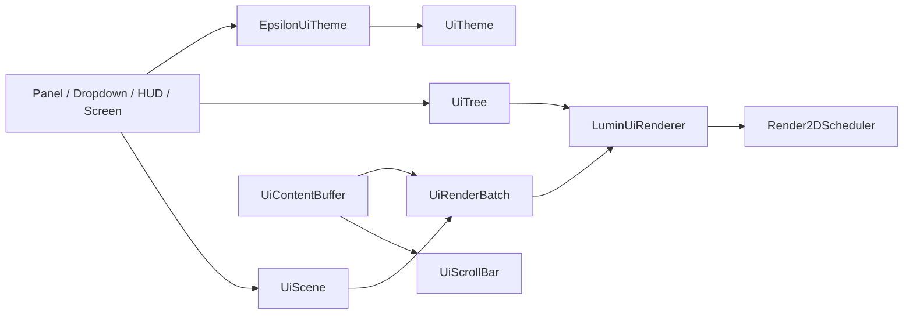

# Epsilon GUI Library

## 定位

`com.github.epsilon.gui.lib` 是 Epsilon 内部可复用的声明式 GUI 库，负责 UI 几何、节点树、布局、语义
分层、渲染批次、滚动视口和缓存失效状态。它不继承 Minecraft `Screen`，也不知道 Module、Setting、
Panel 或 Dropdown 的业务模型。

库以源码包形式位于 `common`，不是独立 Gradle 子项目：Lumin Graphics 同样位于 `common`，拆成子项目
会形成 `common -> gui -> common graphics` 的循环依赖。

## 目录

```text
common/src/main/java/com/github/epsilon/gui/
├── lib/
│   ├── UiRect.java               # 通用不可变矩形
│   ├── UiTextMetrics.java        # 文本度量接口
│   ├── UiTheme.java              # 宿主主题契约
│   ├── UiTree.java               # 声明式节点树与布局 DSL
│   ├── control/
│   │   ├── UiScrollBar.java      # 滚动条几何与交互状态
│   │   └── UiTextField.java      # 单行文本输入状态
│   ├── render/
│   │   ├── LuminUiRenderer.java  # UiTree → Render2DScheduler
│   │   ├── UiRenderBatch.java    # scheduler/layer 批次视图
│   │   └── UiContentBuffer.java  # 带裁剪的滚动内容缓冲
│   ├── scene/
│   │   ├── UiLayer.java
│   │   ├── UiLayerStack.java
│   │   └── UiScene.java
│   └── state/
│       └── UiInvalidationState.java
├── theme/                        # MD3Theme 与 EpsilonUiTheme 适配
├── panel/                        # Panel 应用层
├── dropdown/                     # Dropdown 应用层
├── screen/                       # MainMenu、Welcome、账号界面
└── hudeditor/                    # HUD 编辑器
```

`gui/theme`、`gui/panel`、`gui/dropdown`、`gui/screen` 和 `gui/hudeditor` 是库的使用者，不属于库本体。

## 依赖方向



允许的库依赖：

- Java 标准库；
- `graphics` 中的 Lumin 渲染类型（`LuminRenderSystem`、`TextRenderer`、`Render2DScheduler`、
  `Render2DTexture`、`StaticFontLoader`、`TtfFontLoader` 等）；
- `utils.render.animation`；
- 纹理便捷重载使用的 Minecraft `Identifier`。

禁止的库依赖：

- Fabric 或 NeoForge API；
- Module、Setting、Manager 等 Epsilon 业务包；
- `gui.panel`、`gui.dropdown`、`gui.screen`、`gui.hudeditor` 的业务状态。

已知偏差：`lib/control/UiTextField` 目前直接使用 `gui.theme.MD3Theme` 的颜色常量，并导入
`gui.panel.utils.IMEFocusHelper` 处理输入法预编辑。新增库代码不要扩散这类业务依赖；改造该控件时应把
颜色改走 `UiTheme`，把 IME 交互改为宿主注入的回调。

## 快速使用

### 创建场景

```java
private final UiScene scene = new UiScene(EpsilonUiTheme.INSTANCE);

public void renderFrame() {
    scene.beginFrame();

    UiTree tree = UiTree.build(scope -> {
        scope.shadow(20.0f, 20.0f, 160.0f, 80.0f, 8.0f, 12.0f, new Color(0, 0, 0, 80));
        scope.roundRect(20.0f, 20.0f, 160.0f, 80.0f, 8.0f, new Color(32, 32, 36, 240));
        scope.text("Hello", 32.0f, 36.0f, 0.7f, Color.WHITE);
    });

    scene.submit(UiLayer.CONTENT, tree);
    scene.endFrame(); // flush + clear
}

public void close() {
    scene.close();
}
```

`UiScene` 拥有一个 `Render2DScheduler`。同一帧的多个子视图应提交到同一个 scene，最后统一 flush；
`UiScene.batch(layer, relativeLayer)` 返回的 batch 只是 scene 的视图，不拥有 scheduler。

### 相对坐标

```java
UiRect card = new UiRect(40.0f, 30.0f, 180.0f, 96.0f);

UiTree tree = UiTree.build(scope ->
        scope.pushAbsolute(card, local -> {
            local.roundRect(0.0f, 0.0f, card.width(), card.height(), 8.0f, Color.DARK_GRAY);
            local.text("Local coordinates", 10.0f, 10.0f, 0.6f, Color.WHITE);
        })
);
```

`pushRelative` 以当前 bound 为原点，`pushAbsolute` 直接切换到绝对坐标；`stackPush*`/`stackPop` 提供
可嵌套的坐标栈。它们都在 `try/finally` 中恢复父级 bound。

### 简单布局

```java
UiTree tree = UiTree.layout(new UiRect(20.0f, 20.0f, 240.0f, 120.0f), root ->
        root.box(UiTree.Insets.all(8.0f), content ->
                content.column(6.0f, column -> {
                    column.item(24.0f, row -> row.text("Title", 0.7f, Color.WHITE));
                    column.fill(body -> body.roundRect(6.0f, Color.GRAY));
                }))
);
```

`LayoutScope` 负责计算子区域（`box`、`row`、`column`、`layer`），`LinearScope` 用 `item(size)` 固定
尺寸、`fill()` 吃掉剩余空间。布局 DSL 只计算 `UiRect`，最终仍写入同一个 `UiTree.Scope`；复杂业务布局
应保留在 Panel/Dropdown 应用层。

## 主题

所有语义控件都通过 `UiTheme` 获取颜色和尺寸。库类不读取全局 ClientSetting。

```java
UiTheme theme = EpsilonUiTheme.INSTANCE;
UiScene scene = new UiScene(theme);
UiContentBuffer content = new UiContentBuffer(theme);
UiScrollBar scrollBar = new UiScrollBar(theme);
```

新增主题时实现 `UiTheme`，然后在宿主构造这些对象时注入；不要在 `gui/lib` 中导入具体主题类。

## Layer 规则

| 语义层 | 基准值 | 用途 |
|---|---:|---|
| `BACKGROUND` | 0 | 全屏背景 |
| `CHROME` | 100 | 窗口外壳、分区背景 |
| `CONTENT` | 200 | 常规内容 |
| `FLOATING` | 300 | 浮动提示、局部浮层 |
| `POPUP` | 400 | 弹窗 |
| `OVERLAY` | 500 | 最终覆盖层 |

相对 layer 必须位于 `-99..99`（`UiLayerStack` 的 stride 为 100）。超出范围会抛出
`IllegalArgumentException`，避免一个子视图越过相邻语义层。

## 可滚动内容

`UiContentBuffer` 适用于内容构建成本较高、需要裁剪和独立 flush 的列表：

```java
private final UiContentBuffer content = new UiContentBuffer(EpsilonUiTheme.INSTANCE);

UiTree tree = UiTree.build(scope ->
        scope.viewport(content, viewport, scroll, maxScroll, contentHeight,
                mouseX, mouseY, list -> {
                    // 写入列表节点
                })
);
```

宿主顺序为：构建包含 viewport 的 `UiTree` → 提交并 flush 主 `UiScene` → 调用 `UiContentBuffer.flush()` →
内容失效时调用 `clear()` 或由 `UiInvalidationState` 决定重建。

## 生命周期与所有权

- `UiTree` 是当前帧的不可变快照，节点列表不能由调用方修改。
- `UiTree.Scope` 可复用，但每帧开始前必须 `clear()`。
- `new UiRenderBatch(theme)` 拥有自己的 scheduler，关闭 batch 时会释放它。
- `UiScene`、独立 `UiRenderBatch` 和 `UiContentBuffer` 都应在宿主销毁时 `close()`。
- Screen 移除或关闭时必须清空并释放 scene，不得跨帧复用未 flush 的命令。
- renderer 初始化和绘制仍必须发生在 Minecraft 渲染线程。

## Minecraft 26.2 集成

库本身不继承 Minecraft `Screen`，Screen 适配保留在应用层。当前实现已直接核对
`common/build/moddev/artifacts/vanilla-26.2-*-sources.jar`：

- `Screen.extractRenderState(GuiGraphicsExtractor, int, int, float)`；
- `Screen.mouseClicked(MouseButtonEvent, boolean)`、`mouseReleased(MouseButtonEvent)`、
  `mouseDragged(MouseButtonEvent, double, double)`；
- `GuiEventListener.mouseScrolled(double, double, double, double)`；
- `KeyEvent`、`CharacterEvent`、`MouseButtonEvent`、`PreeditEvent` 位于 `net.minecraft.client.input`。

Minecraft 输入事件应由 Screen 转换或路由到具体 Panel/Dropdown 控件，不应进入 `gui/lib` 的公共 API。

## 验证

仓库当前不维护该库的测试源码，也没有测试任务；修改后运行编译并用客户端路径回归：

```shell
./gradlew :common:compileJava
./gradlew :fabric:compileJava :neoforge:compileJava
```

更完整的帧顺序、HUD 提交和 WorldToScreen 说明见 [渲染文档](development/rendering.md)。
