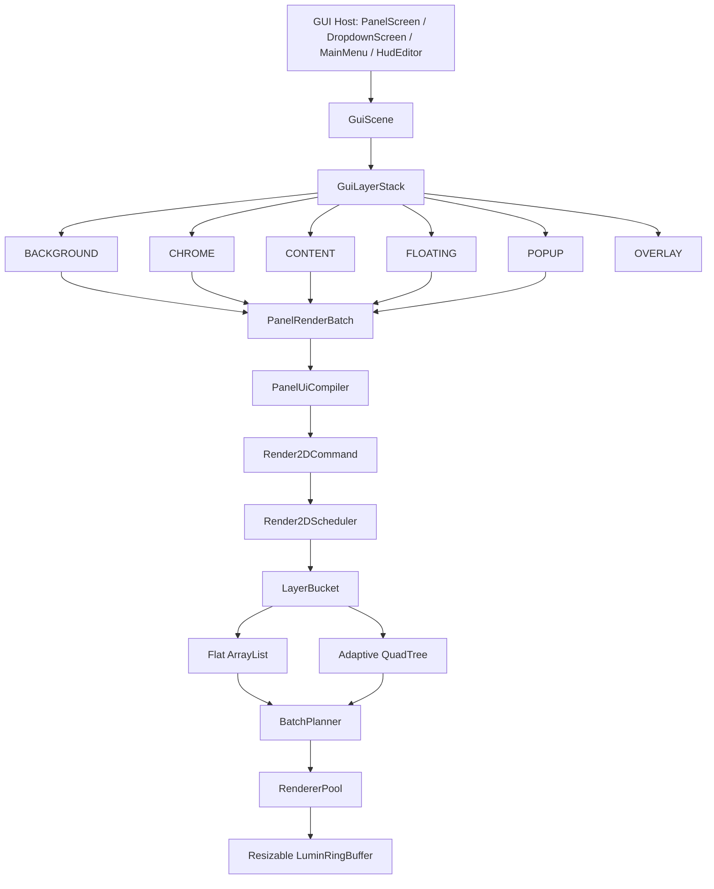
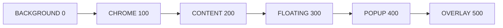
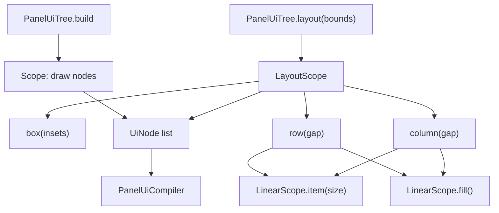
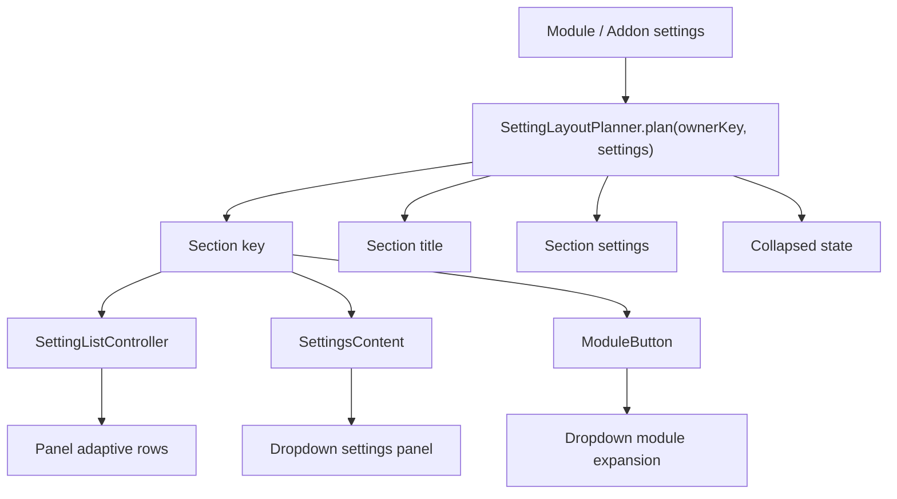
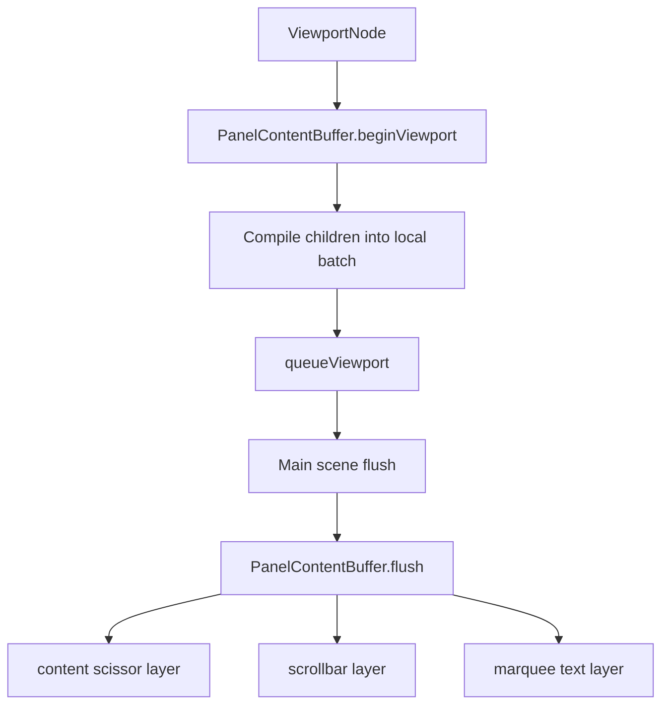
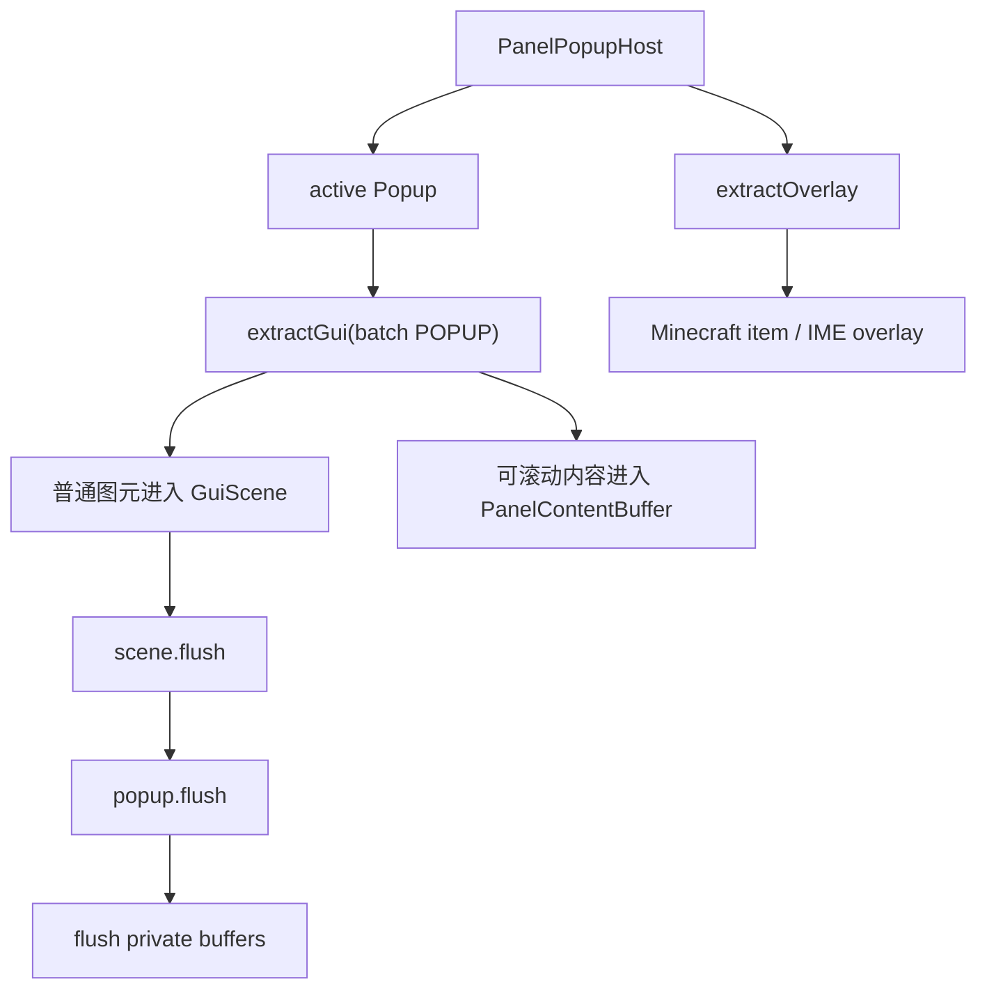

# Epsilon GUI 渲染架构

## 目标

新的 GUI 管线统一为 `GUI -> GUI Layers -> Render2DScheduler`。屏幕、Dropdown、Popup、MainMenu 与 HUD Editor 不再直接持有一组 renderer 做零散的 `drawAndClear`，而是提交声明式 UI 节点或 scheduler 命令，由统一场景按层调度、合批和 flush。

`PanelUiTree` 已移除旧的 `group/memo` 模式。布局由 `PanelUiTree.layout(...)`、`PanelContentBuffer` 和设置自适应分段系统协作完成；滚动列表不再把缓存语义混入 DSL 树。

## 总体架构



## Layer 设计

`GuiLayer` 是语义层，`GuiLayerStack` 把语义层映射到整数 layer。每个语义层预留相对偏移空间，调用方只在自己的语义层里表达局部顺序。



PanelScreen 当前分层：

- `CHROME -20`：主面板、rail、modules/detail 背景。
- `CONTENT -20`：Category rail。
- `CONTENT 0`：模块列表。
- `CONTENT 10`：客户端设置页。
- `CONTENT 20`：模块详情。
- `POPUP`：弹窗外壳和弹窗普通图元。

DropdownRenderer 将旧的多次 `flush()` 迁移为 pass layer；每个 pass 映射为 `passIndex * 10`，用于保留旧 Dropdown 的视觉顺序。

## PanelUiTree 与自动布局



自动布局原则：

- `LayoutScope` 只负责计算子区域，实际绘制仍写入同一个 `Scope`。
- `row/column` 使用游标推进，`item(size)` 固定尺寸，`fill()` 吃掉剩余空间。
- 旧手写坐标节点保留，用于现有 Panel 和 Dropdown 中需要精细定位的区域。
- 旧 `group/memo` 已移除，缓存不再作为 DSL 树节点存在。

## 自适应设置布局

设置列表不再通过 `SettingGroup` 或 `.group(...)` 声明分组。所有模块和 Addon 只按字段声明顺序注册 setting，GUI 通过 `SettingLayoutPlanner` 自动生成可折叠 section。



推断规则：

- 小型设置列表直接内联显示，不生成可折叠 header。
- `rootSetting()` 会作为根级设置直接显示。
- 常见语义名会自动归类，例如 `Selection`、`Appearance`、`Notification`、`Anti Cheat`、`Force Place`、`Place`、`Break`、`Calculation`、`Render`、`Colors`。
- `ColorSetting` 默认进入 `Colors`，`ButtonSetting` 默认进入 `Actions`。
- 折叠状态以稳定 `ownerKey + section title` 保存，Panel、Dropdown、Addon 之间互不污染。

## PanelContentBuffer

滚动列表、设置列表和部分 Popup 列表使用 `PanelContentBuffer`。



视口内容缓存是局部 scheduler-backed 批次。主 scene 先 flush 背景和普通内容，随后 flush 私有 viewport 缓冲，避免滚动内容被面板背景覆盖。

## Render2DScheduler

```mermaid
flowchart TD
    A["LayerHandle.add*"] --> B["Render2DCommand"]
    B --> C["CommandStore"]
    C --> D["LayerBucket"]
    D --> E{"count >= threshold?"}
    E -->|"否" F["Flat ArrayList"]
    E -->|"是" G["QuadTreeBucket"]
    F --> H["stable sequence sort"]
    G --> H
    H --> I["group by kind + scissor"]
    I --> J["RendererPool.acquire"]
    J --> K["emit commands"]
    K --> L["draw batch"]
```

实现要点：

- 小批量 layer 使用 `ArrayList`，避免四叉树固定分配成本。
- 达到阈值后升级到四叉树，跨象限图元保留在父节点，避免重复提交。
- flush 前恢复提交序，再按 `kind + scissor` 规划批次。
- 同一 layer 内会为了合批按 renderer 类型重排；需要严格遮挡顺序时使用更细 layer 表达。
- renderer pool 按 `(kind, scissor)` 复用 renderer，减少 renderer 和 GPU buffer 创建。

## Buffer 策略

`LuminRingBuffer` 支持 `ensureCapacity(requiredBytes)`。2D renderer 使用较小初始 buffer，并在写入前按需求扩容。

当前策略：

- `RectRenderer`：4 KiB 起步。
- `RoundRectRenderer`：4 KiB 起步。
- `RoundRectOutlineRenderer`：4 KiB 起步。
- `ShadowRenderer`：4 KiB 起步。
- `TriangleRenderer`：6 KiB 起步。
- `TextureRenderer`：每纹理桶 16 KiB 起步。
- `TtfTextRenderer`：默认 256 KiB 起步，按 glyph quad 自动扩容。

## Popup 架构



Popup 不再默认提前 `flushAndClear` 主 scene batch。普通弹窗图元由主 scene 帧尾统一输出；只有 viewport 和物品预览等私有资源在 `Popup.flush` 或 `extractOverlay` 中处理。

## 入口状态

- `PanelScreen`：已迁移到 `GuiScene + PanelRenderBatch`。
- `DropdownScreen`：已迁移到 `GuiScene`，`DropdownRenderer` pass 映射为 layer。
- `MainMenuScreen`：UI 层已使用 `GuiScene`，背景 shader 保持独立目标。
- `HudEditorScreen`：编辑器 chrome 使用 `GuiScene`，HUD 模块通过 `renderWithBatch` 进入统一 batch。
- `PanelUiTree.group/memo`：已移除。
- `SettingGroup/.group(...)`：已移除，设置分段由 `SettingLayoutPlanner` 自动完成。
